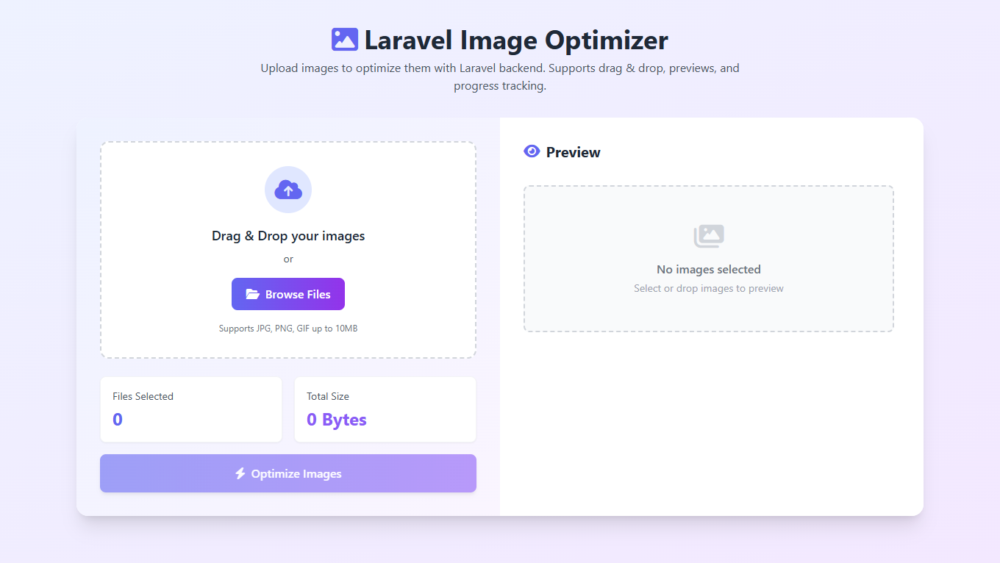

# Image Optimization App

A simple web-based application that allows users to upload images, compress them, and download optimized versions. Built using Tailwind CSS, Alpine.js, and a minimal HTML layout.

## ✨ Features

- Drag and drop image upload
- Automatic image compression
- Download individual or all optimized images
- Responsive and modern UI
- Built with Alpine.js and Tailwind CSS

## 🚀 How to Use

1. **Upload Images**  
   Drag and drop your images into the upload area or click to select from your device.

2. **Optimize**  
   Images will be compressed and displayed in the Optimized Results section.

3. **Download**
    - Click the download icon on each image to download individually.
    - Use the **Download All** button to download all optimized images at once.

## 🛠️ Technologies Used

- [Alpine.js](https://alpinejs.dev/) – Lightweight JavaScript framework
- [Tailwind CSS](https://tailwindcss.com/) – Utility-first CSS framework
- HTML5, JavaScript (ES6)

## 📸 Screenshot

## 📄 License

This project is open source and free to use under the MIT License.

## 👤 Author

**Mehdighazlavi**  
Feel free to reach out or contribute to this project!
